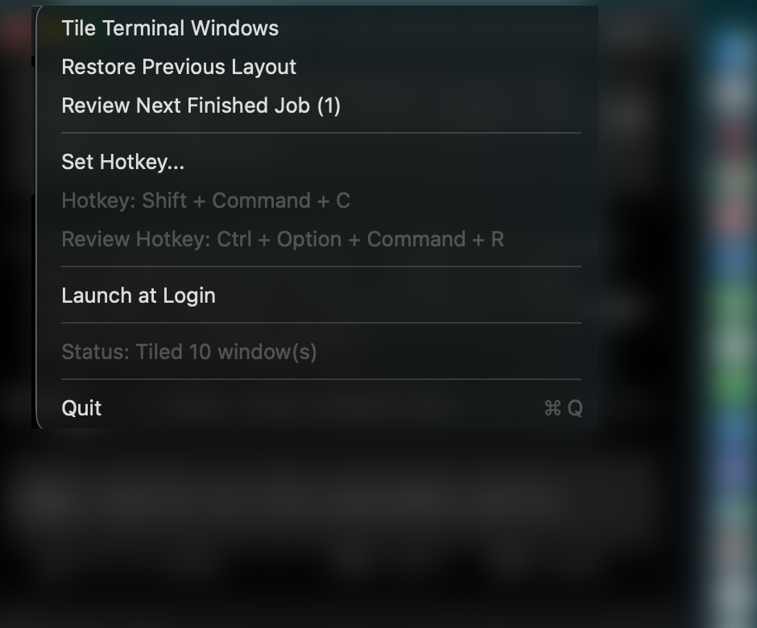

# TerminalGridMenubar

TerminalGridMenubar is a native macOS menu bar app that tiles all open
`Terminal.app` windows into a readable grid with one hotkey.

It is built for people who run many Terminal sessions in parallel and want
consistent placement, readable text, and fast review of finished Codex or
Claude runs.

## What it does

- Runs as a menu bar app (no Dock icon).
- Tiles all open `Terminal.app` windows on the active screen.
- Uses an adaptive grid that maximizes screen usage for 2, 3, 4, 5, 6, 7, 8+
  windows.
- Auto-tunes font size for readability based on window count and tab metrics.
- Restores your previous layout with one click.
- Supports `Launch at Login`.
- Supports global hotkeys:
  - Tile windows: `Ctrl + Option + Command + G`
  - Review next finished job: `Ctrl + Option + Command + R`
- Adds completion signals for `codex` and `claude`:
  - Compact tab title: `project • Codex` or `project • Claude`
  - Sound when the command is done
  - Green tab on success, red on failure
  - Highlight remains until you interact with that tab
  - Finished runs are queued for review mode

## Screenshot

Menu preview:



## Requirements

- macOS 13 or newer
- Apple Terminal (`Terminal.app`)
- `zsh` (for completion hooks)
- `python3` (used by the shell hook to send local socket events)
- `swift` toolchain (for building from source)

## Install from source

Follow these steps to build and run the app locally.

1. Clone the repository and enter the project directory.

```bash
git clone <your-repo-url>
cd terminal-grid-menubar
```

2. Build the app bundle.

```bash
./scripts/build-app.sh
```

3. Copy the app to `/Applications`.

```bash
ditto dist/TerminalGridMenubar.app \
  /Applications/TerminalGridMenubar.app
```

4. Start the app.

```bash
open /Applications/TerminalGridMenubar.app
```

5. Grant macOS permissions when prompted.

- In **System Settings > Privacy & Security > Automation**, allow
  `TerminalGridMenubar` to control Terminal.
- In **System Settings > Privacy & Security > Accessibility**, allow
  `TerminalGridMenubar` if needed for global hotkeys.

6. Install shell hooks for Codex and Claude completion alerts.

```bash
./scripts/install-shell-hooks.sh
source ~/.zshrc
```

## Install from GitHub release

If you do not want to build from source, use the zipped `.app` from the
latest GitHub release.

Releases page: [GitHub Releases](../../releases)

1. Download `TerminalGridMenubar-v1.0.1-macos.zip` from Releases.
2. Unzip it.
3. Move `TerminalGridMenubar.app` to `/Applications`.
4. Open the app once, then grant permissions in System Settings.

## Daily usage

After setup, you use the app from the menu bar icon.

1. Open multiple Terminal windows.
2. Press `Ctrl + Option + Command + G`.
3. The app arranges all windows into a grid on your active screen.
4. If needed, click **Restore Previous Layout** to return to the old layout.

To process finished AI sessions quickly:

1. Run `codex` or `claude` in Terminal tabs.
2. Wait for a sound and color change when a run completes.
3. Press `Ctrl + Option + Command + R` to jump to the next finished run.

## Menu actions

- **Tile Terminal Windows**: Tiles all visible Terminal windows.
- **Restore Previous Layout**: Restores bounds and font sizes from before the
  last tile action.
- **Review Next Finished Job**: Activates the next finished Codex or Claude tab
  and copies a summary to clipboard.
- **Set Hotkey...**: Captures a new global hotkey.
- **Launch at Login**: Starts the app automatically after login.

## How the layout logic works

The tiler evaluates candidate grid shapes (`columns x rows`) and picks the best
score using:

- available screen area,
- minimum cell size,
- limited empty slots,
- practical terminal aspect ratio.

Then it:

1. applies bounds for each window,
2. applies initial font size from window-count defaults,
3. tunes font size using live tab rows and columns,
4. verifies and reapplies font or bounds when Terminal misses an update.

This keeps high window counts aligned and readable.

## Troubleshooting

If clicking **Tile Terminal Windows** does nothing:

1. Confirm the app is running from `/Applications/TerminalGridMenubar.app`.
2. Re-check Automation and Accessibility permissions in System Settings.
3. Restart the app:

```bash
launchctl kickstart -k gui/$(id -u)/io.terminalgrid.menubar
```

If completion colors or sounds do not work:

1. Ensure hooks are installed:

```bash
ls -l ~/.terminal-grid-menubar-hooks.zsh
```

2. Ensure your `.zshrc` sources the hook block:

```bash
rg -n "terminal-grid-menubar hooks" ~/.zshrc
```

3. Reload your shell:

```bash
source ~/.zshrc
```

## Project structure

- `Sources/TerminalGridMenubar/TerminalGridMenubar.swift`: main app logic
- `scripts/build-app.sh`: release build script
- `scripts/install-shell-hooks.sh`: hook installer
- `scripts/terminal-grid-hooks.zsh`: shell hooks for job events

## Limitations

- Supports `Terminal.app` only (not iTerm2).
- Requires local macOS permissions for automation features.

## License

MIT. See `LICENSE`.
